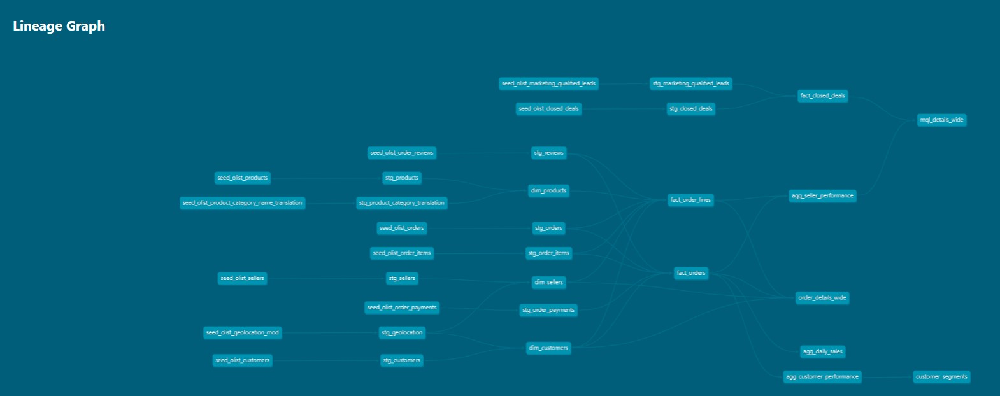

# DBT Core Project with Olist E-commerce Data Analysis

This project demonstrates a real-world DBT implementation using **Google BigQuery** as the data warehouse. The project analyzes Brazilian e-commerce data from Olist, using public datasets available on Kaggle:

- [Brazilian E-Commerce Public Dataset by Olist](https://www.kaggle.com/datasets/olistbr/brazilian-ecommerce)
- [Marketing Funnel by Olist](https://www.kaggle.com/datasets/olistbr/marketing-funnel-olist)

Data citation:
> Olist. (2018). Brazilian E-Commerce Public Dataset & Marketing Funnel Dataset. Kaggle. https://www.kaggle.com/organizations/olistbr

---

## 📊 Data Model

Below is the lineage graph showing how data flows through the warehouse, from source tables to final marts:



---

## ✅ Prerequisites

- Start a new repository in Github and clone it locally via Git HTTPS
- Python 3.8 – 3.12 (we recommend Python 3.10.13)
- `pip` installed
- Google Cloud project with BigQuery enabled
- Service account with BigQuery access and a key file (JSON)

---

## 🛠 Step-by-Step Setup

### 1. Create a Python Virtual Environment (Optional but Recommended)
```bash
python3.12 -m venv ../dbt-env
source ../dbt-env/bin/activate  # On Windows: ../dbt-env\Scripts\activate
```

Create a file named `.python-version` in your repo with the following content:
```text
3.12.7
```

---

### 2. Create `requirements.txt`
At the root of your project, add the following file:
```txt
# requirements.txt

# Core DBT & BigQuery adapter
dbt-core==1.9.4
dbt-bigquery==1.9.1

# Optional libraries
google-cloud-bigquery>=3.10,<3.15
python-dotenv==1.0.1
```

Install the dependencies:
```bash
pip install -r requirements.txt
```

---

### 3. Initialize Your DBT Project
```bash
dbt init my_dbt_project
```
Answer the prompts:
- Project name: `my_dbt_project`
- Adapter: `bigquery`

---

### 4. Configure the Database Connection
Edit the `profiles.yml` file:

- **Linux/macOS:** `~/.dbt/profiles.yml`
- **Windows:** `%USERPROFILE%\.dbt\profiles.yml`

Example configuration:
```yaml
my_dbt_project:
  target: dev
  outputs:
    dev:
      type: bigquery
      method: service-account
      project: your-gcp-project-id
      dataset: your_dataset
      threads: 4
      keyfile: /full/path/to/your/service-account-key.json
      timeout_seconds: 300
      location: US
```

---

### 5. Change Directory to Your Project
```bash
cd my_dbt_project
```

---

### 6. Test the DBT Setup
```bash
dbt debug
```

---

### 7. Run Your First DBT Models
```bash
dbt run
```

---

## 🚀 Common Useful Commands

- **Compile SQL:**
  ```bash
  dbt compile
  ```
- **Run tests:**
  ```bash
  dbt test
  ```
- **Generate docs:**
  ```bash
  dbt docs generate
  ```
- **Serve docs UI:**
  ```bash
  dbt docs serve
  ```
- **Run a specific model:**
  ```bash
  dbt run --select model_name
  ```

---

## ✅ Best Practices

- Keep your service account key secure; don’t commit it to Git.
- Add `.python-version` to guide others on the correct Python version.
- Use `requirements.txt` to pin versions for reproducibility.
- Use environment variables for credentials with DBT Cloud or secure CI/CD pipelines.
- Organize models into subfolders by domain or data source.
- Use source freshness and data tests regularly.
- Store your DBT project in version control (e.g., GitHub).

---

## Resources:
- Learn more about dbt [in the docs](https://docs.getdbt.com/docs/introduction)
- Check out [Discourse](https://discourse.getdbt.com/) for commonly asked questions and answers
- Join the [chat](https://community.getdbt.com/) on Slack for live discussions and support
- Find [dbt events](https://events.getdbt.com) near you
- Check out [the blog](https://blog.getdbt.com/) for the latest news on dbt's development and best practices

---

You're now ready to build with DBT and BigQuery! 🎯
